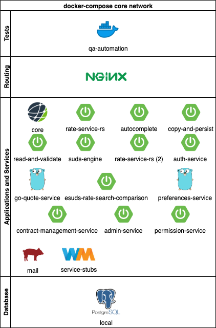
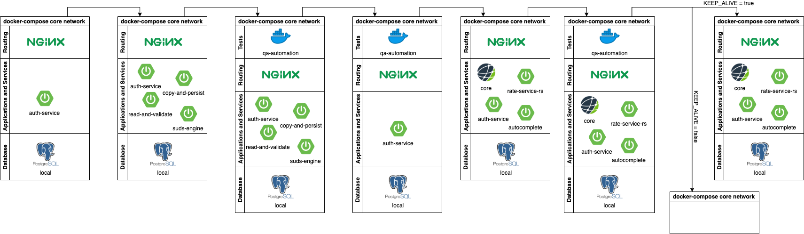
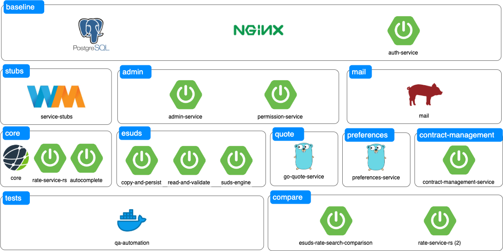

# system-tests
## Available docker componenets


## Loading contracts through eSUDS and running tests against them
1. The `baseline` layer starts up
2. Once the database is done loading, the `esuds` layer is brought up
3. When all the `esuds` containers are up and running, the `qa-automation` image is used to load a specific suite's contracts through `copy-and-persist`
4. The `test-suites` container checks if the contracts are loaded and ready. When they are, the `esuds` layer is shut down
5. The `core` layer is started
6. The `qa-automation` container runs [several] test suite[s]
7. If the `KEEP_ALIVE` flag is not set, then the entire network shuts down at the end. If the `KEEP_ALIVE` flag is set, then the network remains up in the final state.


## Future expansion
The `test-suites` container can leverage cron jobs to load and check data in a manor consistent with that of a rate manager. This means we can stand up a test suite, load data at 10:00 AM, run a search at 10:15 AM, load more data, do another search, etc., and finally tear down the test suite after some period of time (a range of a few minutes to days or weeks!)

## Requirements
1. The data load needs to include logic to update dates in the contracts in order for this approach to be future proof.
2. The Selenium tests need to include logic to use future proof search dates.

## Building components
A few images have been customized for our purposes. These images likely exist in the docker image repo, but if not, you can build them locally.
1. [postgres](postgres/README.md)
2. [service-stubs](service-stubs/README.md)

### But I need the latest and greatest stuff that _developer-bob_ checked in!
Need the latest and greatest? Check out the [new build scripts](scripts/build/README.md) for instructions on how to build an entire set of images for testing!

## Running the system-tests network
### Configuration
#### The .env file
Set the following enviroment variables in [.env](.env).
1. `REMOTE_DB_USER`: This is the database user on the remote system you will be copying database content from.
2. `REMOTE_DB_ADDR`: This is the hostname of the system the remote database is running on.
3. `REMOTE_DB_DB`: This is the name of the remote database you will be copying content from
4. `REMOTE_SSH_USER`: This is the user you will be connecting to the remote system the database is running on.

##### Images
You may need to set/update the image versions as required in [.env](.env).

If this is not the first time you have run the `system-tests` suite(s) on your machine, make sure you have the latest and greatest of each image by issuing the following command for each one you need to update: `docker pull <image>`
###### Docker image update example
```bash
docker pull gcr.io/awesomecstools/system-tests/java/develop:latest
```
Auth with Google CLI for access if access is denied. We recommend installing [gcloud-cli](https://cloud.google.com/sdk/docs/quickstarts) through your favorite package manager
```bash
gcloud auth configure-docker
```

#### Copy private key with access to remote database server to keys directory
```bash
cp ~/.ssh/id_rsa ./postgres/mnt
```

Add host entry to `./postgres/mnt/known_hosts` file for the database server to copy from
```bash
ssh-keyscan -H <db-host> >> ./postgres/mnt/known_hosts
cat /etc/hosts | grep <db-host> > ./postgres/mnt/hosts
```

### Run a single suite
```bash
# templates
./scripts/run-suite <path to private key> <suite> <keep-alive>
./scripts/run-suite-no-esuds <path to private key> <suite> <keep-alive>

# example which loads contracts through esuds
./scripts/run-suite /home/user1/.ssh/id_rsa maeu false

# example that does not load contracts through esuds
./scripts/run-suite-no-esuds /home/user1/.ssh/id_rsa maeu false
```

### Run core, add layers, and leave it running for development
```bash
# templates
./scripts/run-suite-no-esuds <path to private key> <suite> <keep-alive> && ./scripts/layer <layer> up

# example that does not load contracts through esuds
./scripts/run-suite-no-esuds /home/user1/.ssh/id_rsa maeu true && \
	./scripts/layer quote up && \
	./scripts/layer prefereneces up
```
#### Available layers and commands
Not all components are required for all tests. Certain tests only require a few containers to be up and running at any given time. Some tests may require some layers to be active at different times. The available layers are shown below.



Specific details about the mail layer can be found [here](./docs/mail.md)

##### Layer commands
The `baseline` and `core` layers probably do not need to be stated in this way since most often developers should stand up the network with the `./scripts/run-suite*` scripts.
```bash
# Start up the database, nginx, and auth-service. This is the only layer which requires a VPN connection. This one should not be needed if the run-suite* scripts are being used.
./scripts/layer baseline up
# Start up the admin-service and the permission-service
./scripts/layer admin up
# Start up the core app, rate-service-rs, and autocomplete. This one should not be needed if hte run-suite* scripts are being used.
./scripts/layer core up
# Start copy-and-persist, read-and-validate, and suds-engine
./scripts/layer esuds up
# Start go-quote-service
./scripts/layer quote up
# Start preferences-service
./scripts/layer preferences up
# Start contract-management-service
./scripts/layer contract-management up
# Start esuds-rate-search-comparison and rate-service-rs (second instance)
./scripts/layer compare up
# Start up the mail layer
./scripts/layer mail up
# Start up the service stubs
./scripts/layer stubs up
```
##### Start EVERYTHING up! (Not recommended)
```bash
./scripts/run-suite-no-esuds /home/user1/.ssh/id_rsa maeu true && \
	./scripts/layer admin up && \
	./scripts/layer esuds up && \
	./scripts/layer quote up && \
	./scripts/layer preferences up && \
	./scripts/layer contract-management up && \
	./scripts/layer compare up && \
	./scripts/layer mail up && \
	./scripts/layer stubs up && \
```

### Piece by piece
```bash
./scripts/layer baseline up
# monitor the logs until the database is loaded (~3 min)
docker logs -f system-tests_psql_1
# start up the esuds containers
./scripts/layer esuds up
# load the contracts via esuds
docker run \
	--volume $(pwd)/esuds/mnt/in:/home/cron/mnt/in \
	--network system-tests \
	--env DB_ADDR=psql \
	--env DB_DB=local \
	--env DB_USER=cs_user \
	gcr.io/awesomecstools/system-tests/maeu-test-suite:latest /usr/local/cargosphere/scripts/load-esuds-contracts.sh maeu
# tear down the esuds containers
./scripts/layer esuds down
# start up the core containers
./scripts/layer core up
# run the tests
./scripts/tests
```

### Set up for QA-automation development:
Having done a local docker build of the qa-automation project:

```bash
./scripts/layer baseline up
# monitor the logs until the database is loaded (~3 min)
docker logs -f system-tests_psql_1
# start up the esuds containers
./scripts/layer esuds up
# load the contracts via esuds
docker run \
	--volume $(pwd)/esuds/mnt/in:/home/cron/mnt/in \
	--network system-tests \
	--env DB_ADDR=psql \
	--env DB_DB=local \
	--env DB_USER=cs_user \
	qa-automation:latest /usr/local/cargosphere/scripts/load-esuds-contracts.sh maeu
# tear down the esuds containers
./scripts/layer esuds down
# start up the core containers
./scripts/layer core up
```

You can then run tests against this local environment using the qa-automation .jar as described in the qa-automation README.md

### Stop a single service
```
docker-compose rm -f -s -v <service_name>
```

# Misc
## Existing environments, users, and credentials
### Environment: QAAUTO
#### Credentials
* `qaauto : qaauto123`
* `qaauto_super: pass`

### Environment: E-MAEU
#### Credentials
* `e-maeu : e-maeu123`
* `e-maeu_super : pass`

### Environment: E-ONEY
#### Credentials
* `e-oney : e-oney123`
* `e-oney_super : pass`

## Load a contract through eSUDS
```
TOKEN=`curl -k -X POST --header 'Content-Type: application/json' --header 'Accept: application/json' -d '{ "environment": "E-MAEU", "password": "12345a", "username": "e-maeu_super" }' 'http://proxy/api/auth/login' | python -c "import sys,json; print json.load(sys.stdin)['accessToken']"` && curl -k --header 'Accept: application/json' --header "Authorization: bearer $TOKEN" "http://proxy/api/cap/contracts/maeu"
```

## Create a new environment
The files 1001 - 1005.sql in the postgres/assets/tmp directory contain examples of SQL for adding an environment.  Add another numbered SQL file with the necessary inserts, and then add the corresponding numbered shell script in the postgres/assets directory with the same code as 1001.sh - 1005.sh but with correct .sql file name.

i.e. if you've added 1006.sql, add 1006.sh in the postgres/assets directory containing the following:

```
#!/bin/ash
echo "Loading /docker-entrypoint-initdb.d/tmp/1006.sql"
psql -d local < /docker-entrypoint-initdb.d/tmp/1006.sql

```

There are `copyData` commands in 2000.sh, 2100.sh, and 2200.sh that must also be copied within those files for the new environment.

If you plan on uploading contracts via SUDS / eSUDS for this environment you should also create a folder named for that environment like the ones that exist in esuds/mnt/err, /esuds/mnt/in, and /esuds/mnt/out.  Then add the contract as a .csv file to the qa-automation project's contracts/{newEnvName} folder. Then follow the steps in the  **Set up for QA-automation development** section above, replacing occurences of `maeu` with the new environment scac.

# Troubleshooting
**I get the error "./docker-compose.yaml" is unsupported...**
> ERROR: Version in "./docker-compose.yaml" is unsupported. You might be seeing this error because you're using the wrong Compose file version.

If you see this error, then you need to upgrade your docker-compose version. Uninstall docker-compose and reinstall with the latest version: https://docs.docker.com/compose/install/
