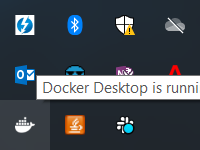
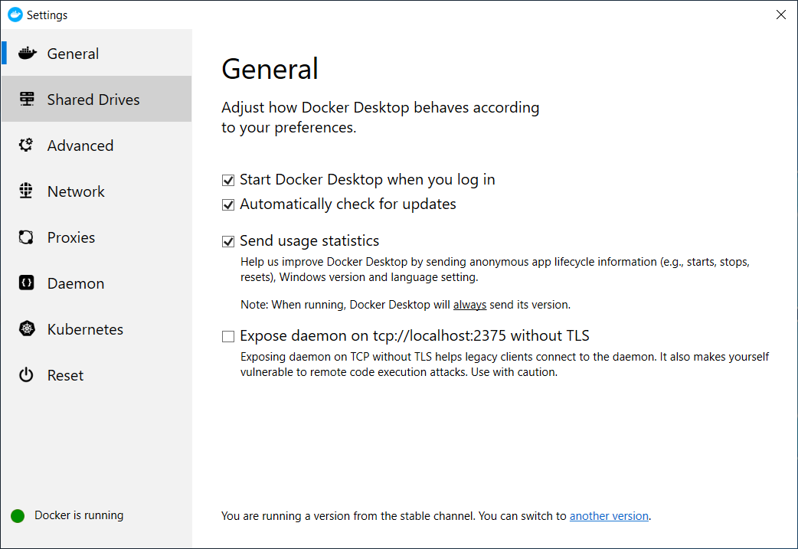
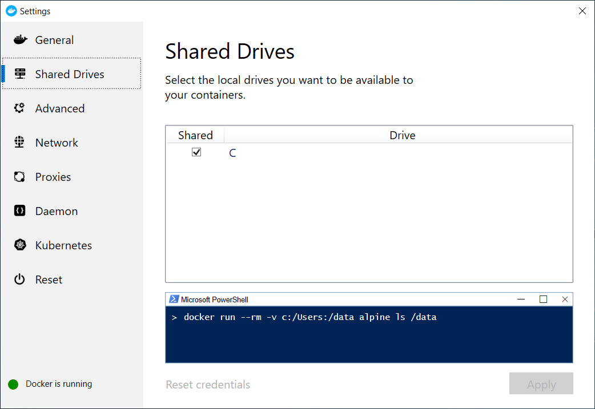
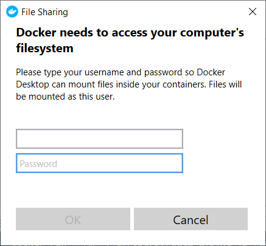

# The docker network will not start and I'm seeing volume mount issues
For Windows users, if the system password changes, volume mounts will not work when trying to start the docker network. To re-authenticate: click on the docker system tray icon in the lower right corner of your desktop…

and select `Settings…`

Click on the `Shared Drives` menu item on the left side

Click `Reset credentials` at the bottom of the screen

# I have the `latest` version of the core image, but I don't see the code updates I expect
If this is not the first time you are using the core image, and you have selected the `latest` tag, you likely have already download it. Docker does not automatically pull updates, so you have to do this manually. The following command should help: `docker pull gcr.io/awesomecstools/system-tests/java/develop:latest`. The SHA should match the latest one on [GCP's container registry](https://console.cloud.google.com/gcr/images/awesomecstools?project=awesomecstools&folder&organizationId)
The SHA of the downloaded image can be seen along with the 'docker pull' command.
The GCP container registry SHA for core can be checked at the location gcr.io/awesomecstools/system-tests/java/develop 
